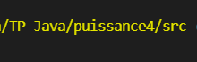
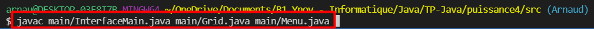
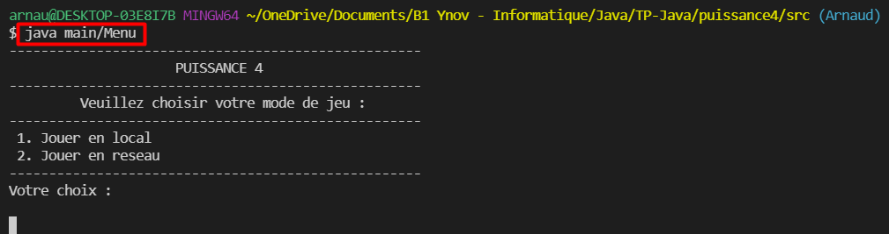

✔️ B2 JAVA - TP FIL ROUGE - PUISSANCE 4 ✔️
---

### Comment lancer le Puissance 4 ?
>---
Tout d'abord vous devez vous rendre dans le répertoire **src/**.

Vous devez ensuite compiler les fichiers **main/Menu.java**, **main/InterfaceMain.java** et **main/Grid.java** :

Après cela il suffira d'exécuter la classe **Menu** pour lancer le **Puissance 4** :

### Structure du code et Problèmes connus
>---

